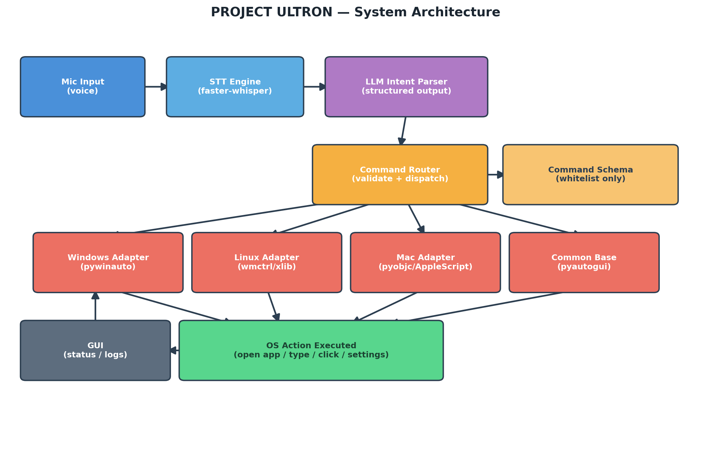

# Architecture

Mic -> STT (faster-whisper) -> LLM Intent Parser -> Command Router -> Platform Adapter -> OS Action

The LLM never executes anything directly. It returns a structured command
chosen from the whitelist in `app/intent/schema.py`. The router in
`app/router/dispatcher.py` validates that command before dispatching it to
the correct platform adapter in `app/automation/`.

## Pipeline steps

- **Mic Input** — raw audio captured continuously or on a wake-word/hotkey trigger.
- **STT Engine** — converts spoken audio into raw text.
- **LLM Intent Parser** — reads the raw text and returns a structured JSON
  command (function name + arguments) chosen from a fixed, predefined list —
  never free text.
- **Command Schema** (`app/intent/schema.py`) — the whitelist defining every
  command the system is allowed to execute (e.g. `open_app`, `web_search`,
  `type_text`, `open_file`, `change_setting`).
- **Command Router** (`app/router/dispatcher.py`) — validates the JSON
  against the schema, rejects anything malformed or outside the whitelist,
  and asks for confirmation before destructive actions.
- **Platform Adapters** (`app/automation/`) — OS-specific implementations
  (Windows / Linux / Mac) that all share one common interface (`base.py`),
  plus a shared base layer for simple keyboard/mouse actions.
- **OS Action** — the actual action performed on the machine.
- **GUI** — displays live transcription, the parsed command, execution
  status, and logs.
